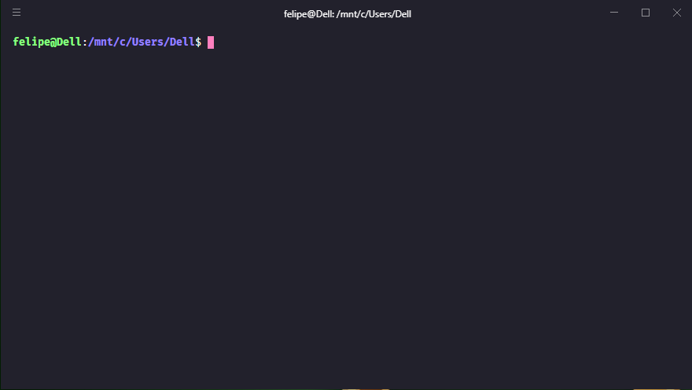
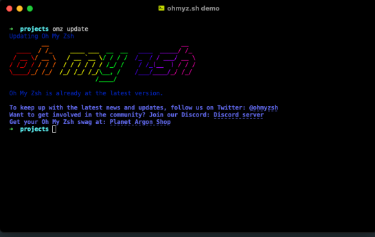
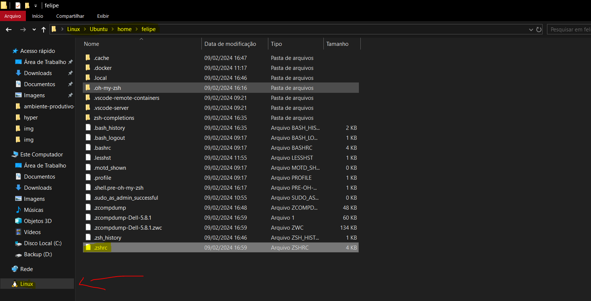
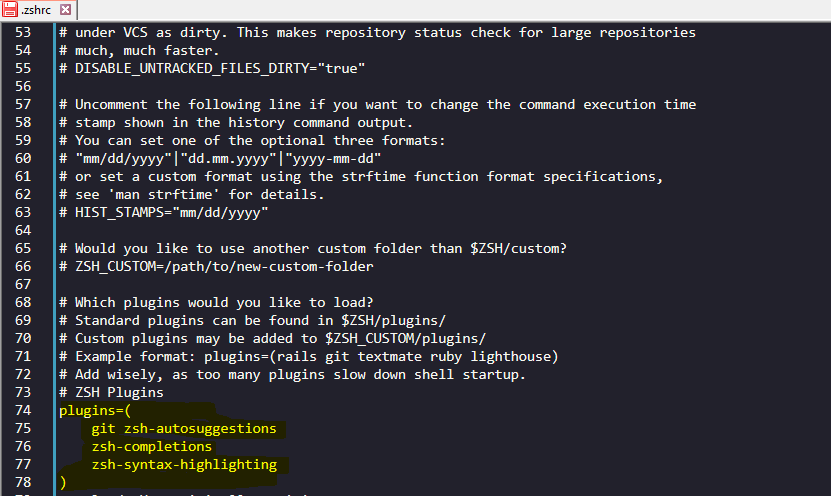
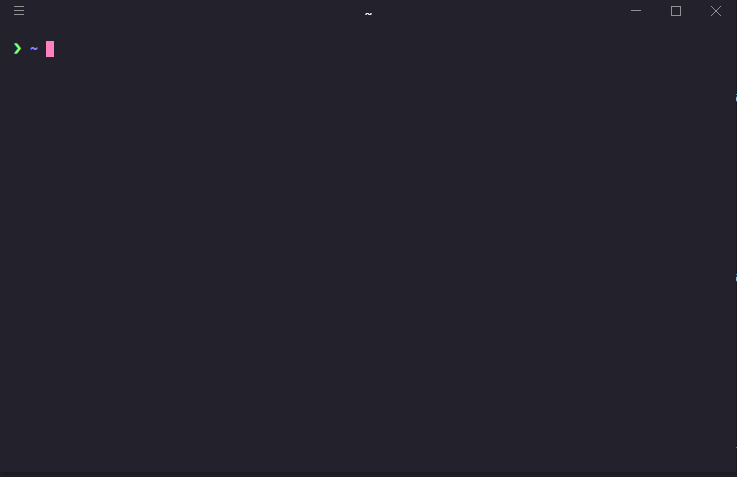
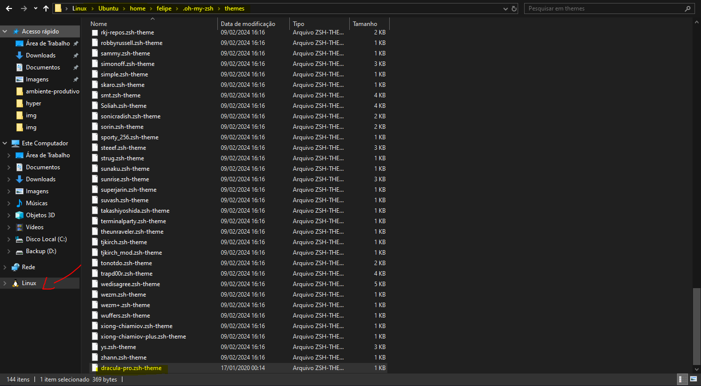
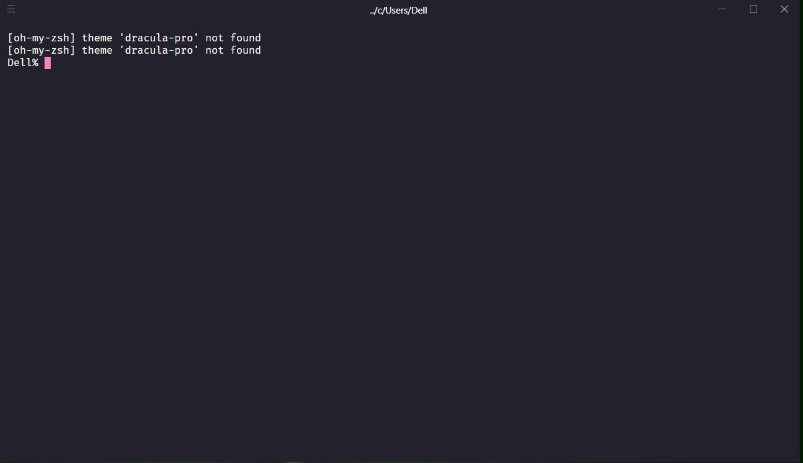

# 🔥 Guia 2 - - Ambiente DEV produtivo com OhMyZSH e HyperTerminal no Windows

## Antes de tudo, se você não realizou as configurações de WSL, volte para o Guia 1.
- Guia 1 - Produtividades no Windows com (WSL2) + Docker: [https://github.com/fegoncalvesac/wsl2-docker-quickstart](https://github.com/fegoncalvesac/wsl2-docker-quickstart)


## Vamos continuar, instalando as ferramentas e baixando os pacotes necessários


### Ferramentas
- [HyperTerminal](https://releases.hyper.is/download/win)
- [Fira Code](https://github.com/tonsky/FiraCode)
- [JetBrains Mono](https://www.jetbrains.com/lp/mono/)
- [dracula-pro-themes](https://1drv.ms/u/s!AuXLpUXd3wwLh30BhC2OZNQbuogX?e=gVW0ac)


## Instalação do Hyper Terminal

Instale o Hyper, é bem simples, basta avançar e finalizar!
após instalado, iremos acessar o caminho abaixo:

```txt
%appdata%\Hyper\.hyper_plugins\local
```
dentro da posta local, iremos colocar os temas dracula que deixarei disponivel na pasta [Temas Hyper](temas/Hyper/)
copie os temas e coloque na pasta local.

O Proximo passo é alterar o arquivo (.hyper) localizado no caminho abaixo:

```txt
%appdata%\Hyper\
```
substitua o arquivo .hyper.js pelo arquivo com o mesmo nome disponivel na pasta [dotfiles](dotfiles)
 
* basicamente no arquivo está definido que quando o hyper abrir, ele vai carregar diretamente o WSL, igual fizemos no Windows Terminal
* e será carregado os temas  que colocamos na pasta local juntamente com a fonte Fira Code.





### Instalando o ZSH (execute os comandos como sudo)

 

Antes de conseguirmos iniciar com qualquer configuração precisamos instalar o Zsh

no hyper terminal que ja deve iniciar com o bash do ubuntu de acordo com a configurações que realizamos mais acima, iremos executar:

```bash
sudo apt install zsh
```

Com o Zsh instalado deve ser possível você executar:

```bash
zsh --version
```
E receber algo como: ```bash zsh 5.9 (x86_64-apple-darwin22.0)```


### Instalando Oh My Zsh (execute os comandos como sudo)

Para instalar o Oh My Zsh você precisa executar o comando abaixo (você deve ter o cURL instalado para executa-lo):

```bash
sh -c "$(curl -fsSL https://raw.githubusercontent.com/ohmyzsh/ohmyzsh/master/tools/install.sh)"
```
ira exibir a mensagem : > Do you want to change your default shell to zsh? [Y/n]
Iremos digitar Y para confirmar e digitar a senha do usuario linux!

> A partir de agora todas configurações que você quer fazer como adicionar variáveis ambientes ou configurar seu terminal de qualquer forma utilize o arquivo ~/.zshrc e não mais o ~/.bash_profile ou derivados.


existem 3 complementos para o oh my zsh que são indispensaveis ao meu ver, são elas:

> syntax-highlighting 

```bash
git clone https://github.com/zsh-users/zsh-syntax-highlighting.git ${ZSH_CUSTOM:-~/.oh-my-zsh/custom}/plugins/zsh-syntax-highlighting
```

> zsh-autosuggestions

```bash
git clone https://github.com/zsh-users/zsh-autosuggestions ${ZSH_CUSTOM:-~/.oh-my-zsh/custom}/plugins/zsh-autosuggestions
```

>zsh-completions

```bash
git clone https://github.com/zsh-users/zsh-completions ${ZSH_CUSTOM:-${ZSH:-~/.oh-my-zsh}/custom}/plugins/zsh-completions
```

```bash
fpath+=${ZSH_CUSTOM:-${ZSH:-~/.oh-my-zsh}/custom}/plugins/zsh-completions/src
```
após executar os comandos adicione os plugins no arquivo .zshrc

você pode acessar o caminho direto pelo mapeamento de rede do linux e editar utilizando o notepad ++ 




Abaixo os plugins adicionados




```txt
plugins=(
	git zsh-autosuggestions 
	zsh-completions 
	zsh-syntax-highlighting
)
```

adicione ao final do arquivo .zshrc o seguinte comando, para que ao abrir o Hyper, ele ja caia direto na pasta do usuário do ubuntu.

```txt
cd /home/felipe
```

é assim que ficará o hyper terminal, ao final da nossa configuração, com os plugins de autocomplete e sugestões instalados!



irei deixar na pasta [dotfiles](dotfiles/.zshrc) o meu arquivo .zshrc no qual está configurado ao meu gosto, você pode utilizar como base para personalizar o seu zsh, os plugins ja estão adicionados, e também o tema Dracula para o zsh que você pode obter em: [dotfiles](/Temas/zsh/dracula-pro.zsh-theme)




caso apareça a mensagem abaixo, ou alguma relacionada aos plugins, certamente foi instalado incorretamente ou não foi adicionado no .zshrc




## Quer dicas como ser mais produtivo no Windows?

Acesse os tutorias abaixo:

- Guia 1 - Produtividades no Windows com (WSL2) + Docker: [https://github.com/fegoncalvesac/wsl2-docker-quickstart](https://github.com/fegoncalvesac/wsl2-docker-quickstart)
- Como montar um ambiente produtivo no VSCode: [https://github.com/argentinaluiz/my-vscode-settings](https://github.com/argentinaluiz/my-vscode-settings)
